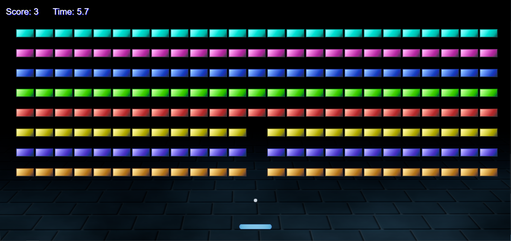

# Breakout Game

[Art assets](https://joyrider3774.itch.io/basic-breakout-asset-pack) provided by Joyrider3774.

[Sound asset](https://opengameart.org/content/3-ping-pong-sounds-8-bit-style) provided by Captaincrunch80

# Table of Contents

- [Breakout Game](#breakout-game)
- [Table of Contents](#table-of-contents)
  - [Description](#description)
  - [Features](#features)
  - [Demo](#demo)
  - [Installation](#installation)
  - [Usage](#usage)
  - [Game Controls](#game-controls)
  - [Game Rules](#game-rules)
  - [Screenshots](#screenshots)
  - [Technologies Used](#technologies-used)
  - [Contributing](#contributing)
  - [License](#license)

## Description

This is a classic Breakout game implemented in JavaScript. Breakout is a timeless arcade game where the player controls a paddle to bounce a ball, breaking bricks in the process.

## Features

Responsive design for various screen sizes.
Dynamic ball and paddle movements.
Score tracking and game-over detection.

## Demo

Play [here](https://endeyr.itch.io/breakout).

## Installation

Clone the repository:

Copy code

```bash
git clone https://github.com/your-username/breakout-game.git
```

Navigate to the project directory:

```bash
Copy code
cd breakout-game
```

Open the index.html file in your web browser, I used Live Server in vscode.

## Usage

Play the game by launching a live server.

## Game Controls

Use the left and right arrow keys or a and d to move the paddle.
Press the "Enter" key to restart the game after a game over.

## Game Rules

Your goal is to remove all the blocks by hitting them with the ball. If the ball hits the floor you lose.

## Screenshots



## Technologies Used

JavaScript

HTML

CSS

## Contributing

I am not currently working on this project but feel free to fork and make your own changes.

## License

This project is licensed under the MIT License.
